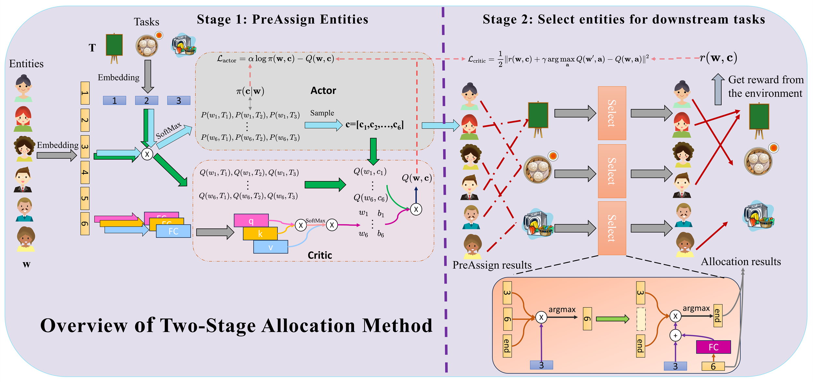

## A Two-stage Reinforcement Learning-based Approach for Multi-entity Task Allocation
The official code for the paper "A Two-stage Reinforcement Learning-based Approach for Multi-entity Task Allocation". This repository contains all the environments and all the code for our algorithm.

# 1. Requirements
Run the following command to install the necessary dependencies.
```
git clone https://github.com/yk7333/d3po.git
cd TaskAllocation
pip install -r requirements.txt
```

# 2. Training
There are a total of 4 environments for the experiment, and corresponding main.py can be run to run experiments in each environment. For example, if you want to run the RBF environment, you can run the following command:
```
python main_RBF.py
```

The checkpoint and figures will be saved in ```./models/...```. You can change the save path by adding '--model_dir=YOU_MODEL_PATH'.
If you don't want to use the pre-assign module and want to sequencely choose entities for each task, run:
```
python main_RBF.py --nopre
```
If you want to use random order to choose entities, run:
```
python main_RBF.py --nopre --random
```
You can get results without Two-head Attention Module (TAM) by running:
```
python main_RBF.py --noattn
```
This will substitute TAM by MLP. Please note that the lack of attention module can cause changes in the number of agents or tasks, and the actor network and critic network cannot accept corresponding inputs, resulting in the inability to generate task allocation results.

If you do not want to use AMIX module to calculate the global critic values of the whole entities, run:
```
python main_RBF.py --nomix
```
When we use the AMIX structure, we calculate the individual value assigned to each task for each entity, and then use AMIX to calculate the overall value value; When the AMIX structure is not applicable, we will use an overall critical network to input the attributes of all entities and tasks and directly estimate the overall value value. Due to the fact that the AMIX structure only affects the computation of the critical network and does not affect the actor network structure, zero-shot task generalization can be achieved without considering fine-tuning the critical network when the number of agents or tasks changes.

# 3.Evaluating
If you want to load checkpoint from the model path, simply running the following command:
```
python main_RBF.py --evaluate --model_dir=YOU_MODEL_PATH
```
If you want to evaluate the zero-shot and few-shot performences, run:
```
python main_RBF.py --evaluate --model_dir=YOU_MODEL_PATH
```
You can change the properties and numbers of entities and tasks in ```./envs```.

